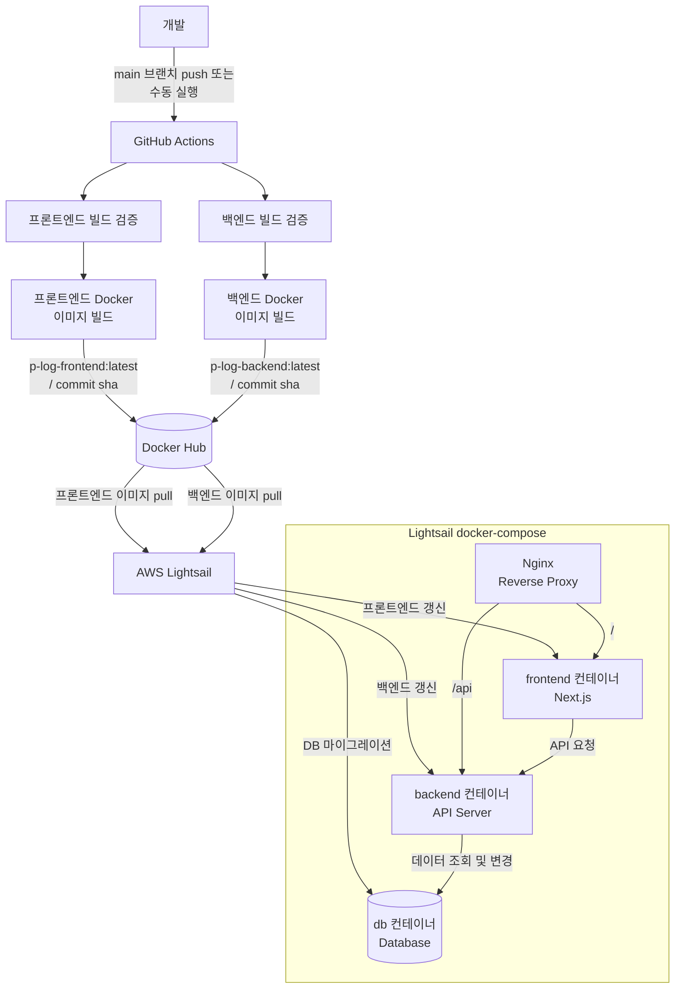

<p align="center">
  <a href="https://pangho.com" target="_blank" rel="noopener noreferrer">
    
  </a>
</p>

<h1 align="center">P.Log Client</h1>

<p align="center">
  개발 기록과 기술 경험을 정리하는 개인 블로그 <strong>P.Log</strong>의 프론트엔드 프로젝트입니다.
</p>

<p align="center">
  <a href="https://pangho.com" target="_blank" rel="noopener noreferrer"><strong>https://pangho.com</strong></a>
</p>

개인 개발 블로그 `P.Log`의 프론트엔드 프로젝트입니다. 게시글 조회, Markdown 기반 작성/수정, 이미지 업로드, 소유자 전용 관리 기능을 제공합니다.

## 기술 스택

### Core

- Next.js 16 App Router
- React 19
- TypeScript
- Tailwind CSS 4

### 상태 관리 및 데이터 통신

- TanStack React Query
- Axios
- Zustand
- React Hook Form
- Zod

### Markdown Editor & Renderer

- CodeMirror 6
- Unified / Remark / Rehype
- remark-gfm
- remark-math
- rehype-katex
- rehype-highlight
- rehype-raw
- rehype-react

### UI

- Shadcn/ui
- lucide-react
- sonner
- class-variance-authority
- clsx
- tailwind-merge

### 개발 도구

- ESLint
- Prettier
- pnpm
- SVGR

## 핵심 기능

### 게시글 목록

- 메인 페이지에서 최근 게시글 목록과 전체 게시글 목록을 제공합니다.
- React Query의 prefetch와 hydration을 사용해 초기 렌더링 데이터를 준비합니다.
- 커서 기반 페이지네이션 응답을 React Query infinite query로 관리합니다.
- 화면 크기에 따라 게시글 아이템 레이아웃을 다르게 표시합니다.

### 게시글 상세

- slug 기반 게시글 상세 페이지를 제공합니다.
- 게시글 제목, 작성일, 태그, 본문을 표시합니다.
- Markdown 본문을 React 컴포넌트로 변환해 렌더링합니다.
- 본문 heading을 기반으로 TOC를 생성합니다.
- 게시글별 SEO metadata, Open Graph, Twitter card, JSON-LD를 생성합니다.

### Markdown 에디터

- CodeMirror 6 기반 Markdown 에디터를 제공합니다.
- 제목, 본문, 태그를 입력해 게시글을 작성할 수 있습니다.
- 데스크톱 환경에서는 작성 화면과 실시간 미리보기를 함께 제공합니다.
- toolbar를 통해 heading, bold, italic, strike, quote, link, image, code block 문법을 삽입할 수 있습니다.
- 기존 게시글 slug를 query string으로 전달하면 수정 모드로 진입합니다.

### 이미지 업로드

- 에디터 toolbar에서 이미지 파일을 선택해 본문에 삽입할 수 있습니다.
- 서버에서 Cloudflare Images direct upload URL을 발급받아 이미지를 업로드합니다.
- 업로드 중에는 임시 Markdown placeholder를 삽입하고, 완료 후 실제 delivery URL로 치환합니다.

### 인증 및 소유자 기능

- 로그인, 로그아웃, 토큰 재발급 API를 연동합니다.
- Axios response interceptor에서 401 응답을 감지하면 refresh token 요청 후 기존 요청을 재시도합니다.
- refresh 실패 시 로그인 페이지로 이동합니다.
- 소유자 계정으로 판별된 사용자에게만 게시글 수정/삭제 버튼과 이미지 업로드 기능을 노출합니다.

### 게시글 관리

- 게시글 작성, 수정, 삭제 API를 연동합니다.
- 작성/수정/삭제 성공 시 React Query cache를 무효화하고 관련 페이지로 이동합니다.
- 삭제 전 확인 dialog를 제공합니다.

### PWA 기본 설정

- Web App Manifest를 제공합니다.
- PWA 아이콘과 maskable 아이콘을 포함합니다.

## 프로젝트 구조

```txt
src
├── app          # Next.js App Router, layout, page, manifest, global style
├── entities     # 도메인 단위 UI 컴포넌트
├── features     # 사용자 액션 단위 기능
├── shared       # 공용 API, hooks, ui, utils, constants, assets, types
└── widgets      # 페이지를 구성하는 복합 UI 블록
```

## 주요 경로

- `/` - 게시글 목록
- `/login` - 로그인
- `/editor` - 게시글 작성
- `/editor?slug=:slug` - 게시글 수정
- `/:slug` - 게시글 상세

## 환경 변수

프로젝트 실행을 위해 다음 환경 변수가 필요합니다.

```env
NEXT_PUBLIC_API_BASE_URL=
```

## 배포 전략

프론트엔드와 백엔드는 각각 GitHub Actions에서 빌드 검증 후 Docker 이미지를 생성해 Docker Hub에 배포합니다.
Lightsail 서버는 Docker Hub의 최신 이미지를 pull한 뒤 `docker-compose`로 필요한 서비스만 갱신합니다.
Nginx는 외부 요청을 받아 프론트엔드로 전달하고, `/api` 요청은 백엔드로 프록시합니다.
백엔드 배포 시에는 컨테이너 갱신 후 DB 마이그레이션을 실행해 애플리케이션 코드와 데이터베이스 스키마를 맞춥니다.



## 실행 방법

```bash
pnpm install
pnpm dev
```

개발 서버는 기본적으로 `http://localhost:3000`에서 실행됩니다.

## 스크립트

```bash
pnpm dev      # 개발 서버 실행
pnpm build    # 프로덕션 빌드
pnpm start    # 프로덕션 서버 실행
pnpm lint     # ESLint 실행
```

## 참고 문서

- [인증 토큰 흐름](./docs/auth-token-flow.md) - HttpOnly Cookie 기반 JWT 인증 정책, 로그인/재발급/로그아웃 흐름, 프론트엔드 구현 기준을 정리한 문서입니다.
